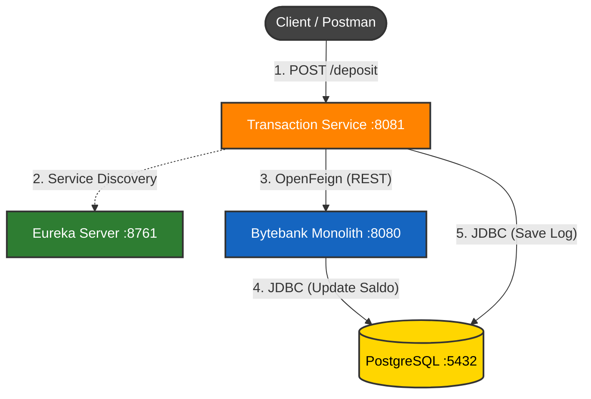

# 🏦 ByteBank Microservices Architecture

Este repositório contém a refatoração do sistema bancário ByteBank, migrando de uma arquitetura monolítica para microsserviços distribuídos utilizando o padrão **Strangler Fig**.

## 🏗️ Arquitetura do Sistema

O sistema é composto por 3 artefatos principais que se comunicam conforme o diagrama abaixo:



1.  🟢 **Eureka Server (Service Discovery):** O "porteiro" que gerencia o registro e localização dos serviços.
2.  🔵 **Bytebank Monolith:** O serviço legado responsável pela gestão de **Usuários** e **Contas**.
3.  🟠 **Transaction Service:** O novo microsserviço especializado em **Operações Financeiras** (Depósito, Saque, Transferência).

## 🚀 Como Executar (Ordem Obrigatória)

Para o sistema funcionar, os serviços devem ser iniciados na ordem exata abaixo.

### Pré-requisitos

- **Java 21**
- **Docker** (Para o banco de dados PostgreSQL)

### Passo 1: Infraestrutura (Banco de Dados)

Na raiz do projeto, certifique-se de que o container do Postgres está rodando:

```bash
docker run --name bytebank-postgres -e POSTGRES_USER=bytebank -e POSTGRES_PASSWORD=docker -e POSTGRES_DB=bytebank_db -p 5432:5432 -d postgres:15-alpine
```

### Passo 2: Service Discovery

Em um terminal, inicie a lista telefônica:

```bash
cd eureka-server
./mvnw spring-boot:run
```

_Aguarde iniciar na porta 8761._

### Passo 3: Core Domain (Monólito)

Em um segundo terminal:

```bash
cd bytebank-monolith
./mvnw spring-boot:run
```

_Aguarde iniciar na porta 8080._

### Passo 4: Financial Core (Transaction)

Em um terceiro terminal:

```bash
cd transaction-service
./mvnw spring-boot:run
```

_Aguarde iniciar na porta 8081._

## 🔗 Acesso e Testes

| Serviço              | URL                     | Função                              |
| :------------------- | :---------------------- | :---------------------------------- |
| **Eureka Dashboard** | `http://localhost:8761` | Visualizar serviços online          |
| **Monolith API**     | `http://localhost:8080` | Criar Usuários e Contas             |
| **Transaction API**  | `http://localhost:8081` | Realizar Depósitos e Transferências |
